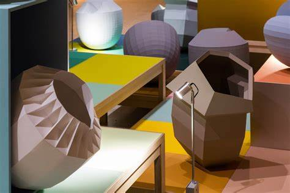

# Musee-et-expo
*Lutter contre les trous de mémoire: recueil de références inspirantes attrapées dans les musées et expositions*

## [Colors, ect.](https://www.lille3000.eu/portail/evenements/colors)
*30/06/2021, au Tripostal de LILLE*

#### 1. Sparkly Black Chair, 2019, [Studio ThusThat](https://thusthat.com/)

*Donner une seconde vie aux résidus de cuivre, les scories. Process: géopolymérisation, 80% moins de CO2.*

#### 2. Red Mud Table Set, 2019, [Studio ThusThat](https://thusthat.com/)

*Donner une seconde vie aux résidus de bauxite, la boue rouge. Process: poterie.*
[En +](https://www.youtube.com/watch?v=aI-rzr9XVOM)

#### 3. Totomoxtle, 2018, [Fernando Laposse](http://www.fernandolaposse.com/)

*Nouveau matériau, le Totoxtle: feuille séchée de l'enveloppe du maïs*
[En +](https://www.youtube.com/watch?v=0r08iXfJ-CM)

#### 4. Pink Beasts, 2020, [Fernando Laposse](http://www.fernandolaposse.com/)

*Installation de paresseux aux poils roses suspendus aux arbres, immeubles, ect. Fibre de agave coloré naturellement avec insecte cochenille.*
[En +](https://www.youtube.com/watch?v=gX9LYYOmD_I)

#### 5. Earth Paint, 2015, [Atelier NL](https://ateliernl.com/)

*Palette de 270 coloris basés sur les tons de la terre autour de Neunen, le village de Van Gogh. Fabrication de peinture à base d'argile et de sable.*

#### 6. Colourful Black Installation, 2017-2020, [Hella Jongerius](http://www.jongeriuslab.com/)

*Autre manière d'aborder le noir: contrairement aux couleurs industrielles qui sont assombris en ajoutant du pigment noir, elle se penche sur les couleurs complémentaires. Différentes nuances, ombres grâce aux faces.*
[En +](https://www.youtube.com/watch?v=qROeUj_3AEE)

#### 7. H.E.R.B.S. (Healthier Environment, Remedy for Body and Skin), 2019, [Nienke Hoogvliet](https://www.nienkehoogvliet.nl/)

*Développe des textiles qui renverse l'impact négatif des textiles classiques avec leur produit chimique qui peuvent être absorbé par la peau. Au contraire, grâce aux bonnes plantes, ce textile est bénéfique au corps.*

#### 8. Furniture factory, 2011, [Lucas Massen](http://www.lucasmaassen.com/)

*Ses enfants peignent les meubles.*

#### 9. Design for Discomfort, 2015, [Lynne Brouwer](https://lynnebrouwer.com/)

*La couleur pour combler l'inconfort.*

#### 10. Copy Right, 2007, [Superflex](https://superflex.net/)

*Peut-on faire une copie d'une pièce originale, en n'opérant que de petites modifications? Originale: Ant Chair*

#### 11. Loopingline, 2021, [Thomas Trum](https://www.thomastrum.nl/)

*Peinture en explorant les nouvelles technologies.*

[En +](https://www.youtube.com/watch?v=hw54HM3FNRk)

#### 12. Noisy Jelly n°6, 2021, [Pinaffo Pluvinage](https://pinaffo-pluvinage.com/)

*Quel est le son de le couleur?* [En +](https://www.youtube.com/watch?v=JeruZbWCLy4)

#### 13. Jigsaw, 2017, [Max Lamb](http://maxlamb.org/)

*Matière durable: plaques de Richlite sciées. Très durable, produit à partir de papier FCS*

#### 14. Modern Animism, 2019-2020, [Patricia Domingues](https://www.patriciadomingues.com/#home)

[En temps réel](https://modernanimism.com/?lang=fr)

#### 15. Paper Chair, 2006, [Jeroen Wand](https://studiojeroenwand.nl/)

#### 16. Mutation, 2012, [Studio Maarten de Ceulaer](https://www.maartendeceulaer.com/)

#### 17. Dawn, 2013, [Michael Johansson](http://www.michaeljohansson.com)

## [Paysage, entre représentation et imaginaire](https://www.ac-ra.eu/paysages-entre-representation-et-imaginaire/)
*21/07/2021, au Musée d'Art Contemporain de MONTELIMAR*

#### 1. Psaume 17 (Seigneur tu me sauves de la violence), 2014, [Florence Louise Petetin](https://reseau-dda.org/fr/artists/florence-louise-petetin)

*Cette jungle est luxuriante, non aménagée par l'homme en dépit de sa présence. Tension entre extériorité et intériorité: exploration mentale, spirituelle de la nature et expérience physique de celle-ci.* 

#### 2. Collection de l'artiste, 2010-2019, [Raphaëlle Paupert-borne](http://www.documentsdartistes.org/cgi-bin/site/affiche_art_web.cgi?&ACT=1&ID=17)

*Cherche à transcrire une émotion feutrée et nourrie d’observations quotidiennes où la banalité prend une qualité poétique. Dessins de voyage rapides.*

#### 3. , El jardin del amor, 2011, [Dominique Castell](http://dominiquecastell.com/index.html)

